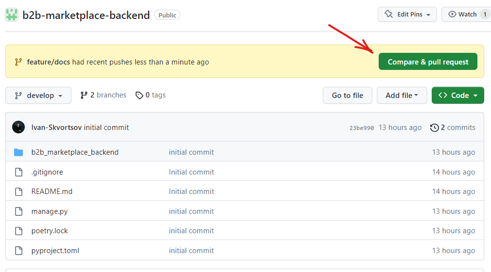

# Памятка по работе с git
Работаем по упрощенному git-flow. Основная ветка для разработки - `develop`. <br>
Соответствено, разработчик создаёт свою ветку от ветки `develop`, реализует фичу и создает ПР (pull request) в ветку `develop`.<br>
ПР ревьюится другими разработчиками. После получения 3-х аппрувов, автор ветки устраняет конфликты (если они есть) и мержит ветку.

## Порядок работы
Переключаемся в ветку develop
```sh
git checkout develop
```
Забираем последние изменения из репо
```sh
git pull
```
Создаём свою ветку и переключаемся на неё
```sh
git checkout -b "feature/docs"
```
Работаем в ветке. По мере необходимости коммитим необходимые изменения.
```sh
git add filename.py
git commit -m "commit name"
```
После завершения работы, забираем последние изменения из ветки `develop` и устраняем конфликты, при необходимости
```sh
git pull origin develop
```
И пушим нашу ветку в репо на github
```sh
git push origin feature/docs
```
Переходим на githuhb, создаём пулл-реквест


Заполняем тайтл, описание, создаем ПР


Ждем ревью коллег. При необходимости, можно тегнуть ревьюеров


После получения 3-х аппрувов мержим ПР кнопкой `Merge pull request`


## Работа с комментариями и запросами на исправление
Если в процессе ревью появились комментарии и замечания:
1. ПР не закрывать не нужно
2. Переключаемся (локально) на ветку с ПР (если вы уже не в ней)
3. Исправляем замечания, с которыми согласны
4. Делаем пуш в репо ```git push origin <имя ветки>```
5. По отработанным замечаниям в ПР проставляем `resolved`

## Пара правил, которые упростят ревью и снизят количество конфликтов при мерже
1. Название ветки должно быть понятное, например `feature/product_model` или `fix/user_permissions`
2. В одном ПР-е должна решаться только одна задача. Не нужно добавлять файлы, которые не относятся к задаче
3. Если найдены ошибки в других файлах, можно оставить комментарий в ПР или написать в телеграм. Для исправления ошибки автор создаст отдельный ПР
4. Непосредственно в ветках `master` и `develop` НЕ работаем
